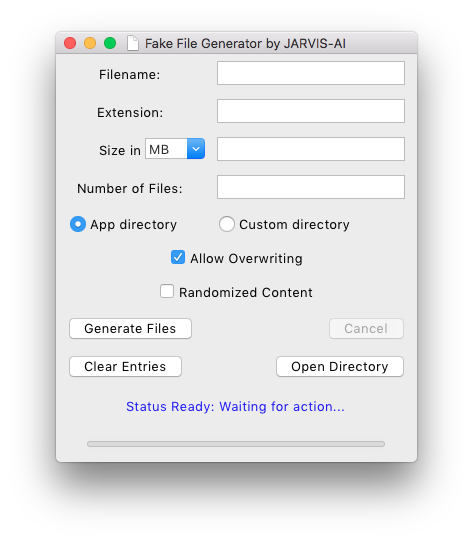
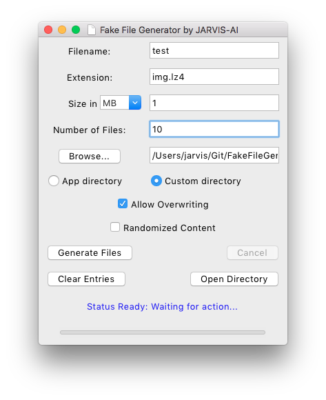
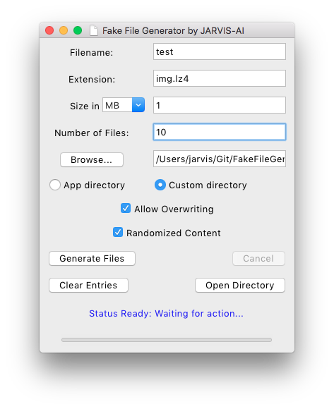
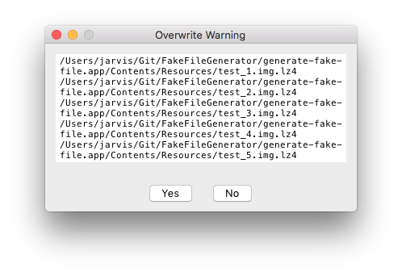
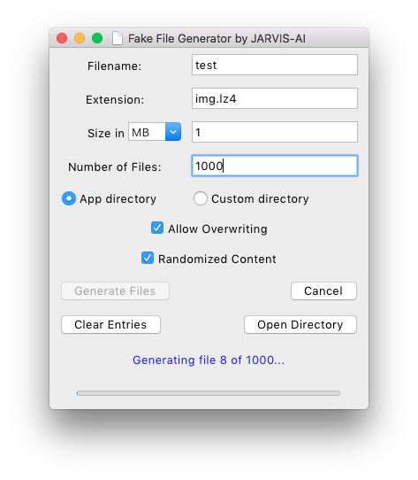
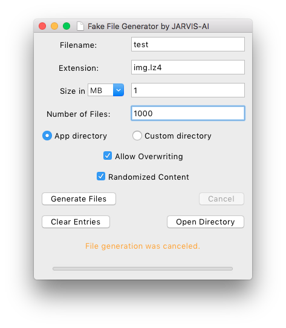
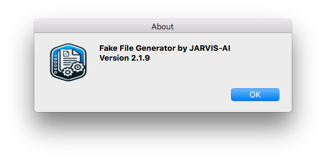

# Fake File Generator by JARVIS-AI

**Version**: 2.1.9

A Python-based app with a Tkinter interface that generates multiple fake files with customizable settings. It supports randomized or empty file content, adjustable file sizes, and customizable naming conventions, making it ideal for testing and data simulation purposes.

---

## Features

- **Customizable File Naming**: Options for unique filenames, with `_1`, `_2`, etc., suffixes in non-overwriting mode.
- **Directory Selection**: Choose to save files in the app’s directory or a user-specified location.
- **File Content Options**: Generate files with randomized content or leave them empty.
- **Flexible File Size and Count**: Specify file size and the number of files to generate.
- **Overwrite Confirmation**: If files already exist, an overwrite confirmation window displays the list of existing files, with "Yes" and "No" options.
- **Memory Management**: Utilizes a chunk-based file generation approach with a 1MB chunk size for optimized performance.
- **Real-Time Progress Tracking**: Includes a progress bar and a cancel button for better user control.
- **Error Logging**: Logs any errors (e.g., `ValueError`, `OSError`) to a log file with timestamps for troubleshooting.
- and many more ...

---

## Installation

1. **Clone the Repository**:
   ```bash
   git clone https://github.com/username/fake-file-generator.git
   cd fake-file-generator
   ```

2. **Install Dependencies**:
   Ensure you have Python 3 and Tkinter installed.

---

## Usage

1. **Run the App**:
   ```bash
   python fake_file_generator.py
   ```

2. **Configure File Options**:
   - **Filename and Extension**: Specify the base filename and extension.
   - **File Size and Count**: Set the file size and number of files to generate.
   - **Overwrite Mode**: Choose whether to allow overwriting of existing files.
   - **Content Options**: Select randomized content or empty content for files.

3. **Start Generation**: Click the "Generate" button, and monitor progress via the progress bar.

---

## Screenshots



<hr />



<hr />



<hr />


<hr />



<hr />



<hr />



<hr />


<hr />



---

## Contributing

Contributions are welcome! Feel free to open issues for feature suggestions or submit pull requests.

---

## Issue

[] Multiple extension need overhaul work ...

---

## License

This project is licensed under the MIT License.

---

## Contact

For questions or support, please reach out via [your email or GitHub profile].

---

Let me know if you'd like more details added!